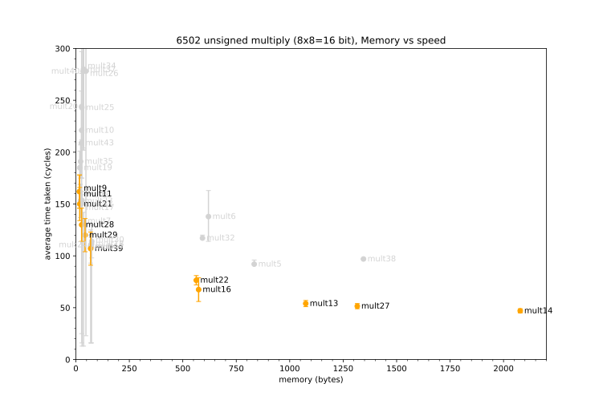
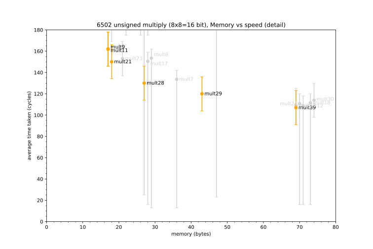
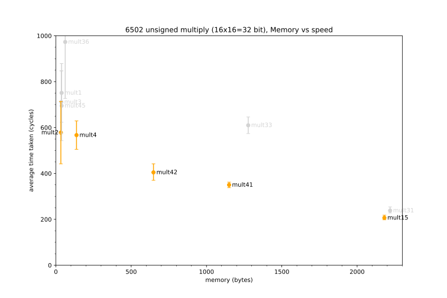
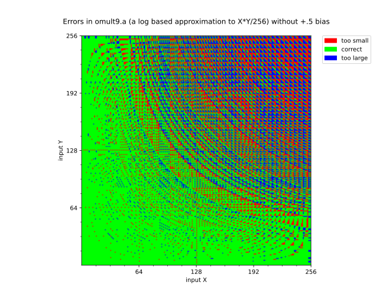
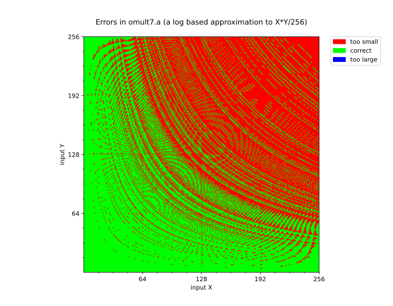
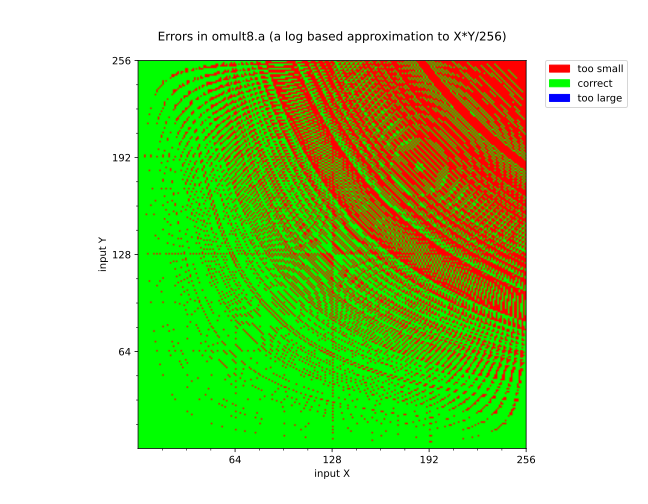
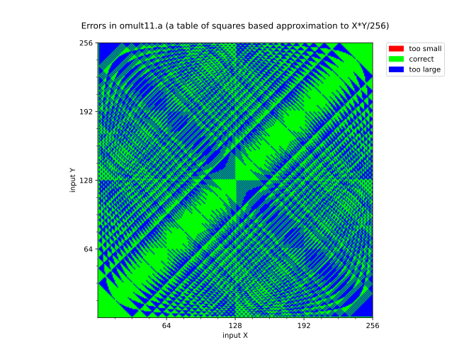

# 6502 Integer Multiplication - which is best?


## Contents

* [Introduction](#introduction)
* [The Implementations](#the-implementations)
* [The Results](#the-results)
* [The Algorithms](#the-algorithms)
	* [Binary Multiplication (Shift and Add)](#1-binary-multiplication-shift-and-add)
	* [Tables of Squares](#2-tables-of-squares)
	* [Logarithms](#3-logarithms)
	* [Four bit multiply](#4-four-bit-multiply)
	* [Booth's Algorithm](#5-booths-algorithm)
    * [Hardware support](#6-hardware-support)
    * [Repeated addition](#7-repeated-addition)
* [Customising](#customising)
* [How to run the tests](#how-to-run-the-tests)


## Introduction

This document compares the runtime performance and memory used by a wide variety of multiplication routines for the 6502 CPU. Over 60 different routines have been exhaustively tested, cycle counted, and the results plotted.

The most common routines available are for unsigned numbers, either 8 bit x 8 bit with a 16 bit result, or 16 bit x 16 bit with a 32 bit result. These are the natural focus, however several other routines are also listed later. There is also section later that discusses how to how to customise the routines, e.g. how to handle signed numbers, adjusting to different bit sizes, etc.

## The Implementations

I have tested the following routines:

### Unsigned multiply

| Source code                  | Bits     | Method                    | From  |
| ---------------------------- | :------: | :-----------------------: | :---- |
| [mult1.a](tests/mult1.a)     | 16x16=32 | [shift&nbsp;and&nbsp;add](#1-binary-multiplication-shift-and-add) | [*6502 Software Design*](https://archive.org/details/6502softwaredesi0000scan/page/124/mode/1up) by Leo J Scanlon (1980) and [codebase64](https://www.codebase64.org/doku.php?id=base:16bit_multiplication_32-bit_product) |
| [mult2.a](tests/mult2.a)     | 16x16=32 | [shift&nbsp;and&nbsp;add](#1-binary-multiplication-shift-and-add)   | [The Merlin 128 Macro Assembler disk, via The Fridge](http://www.ffd2.com/fridge/math/mult-div.s)
| [mult3.a](tests/mult3.a)     | 16x16=32 | [shift&nbsp;and&nbsp;add](#1-binary-multiplication-shift-and-add) | [Neil Parker](https://llx.com/Neil/a2/mult.html) |
| [mult4.a](tests/mult4.a)     | 16x16=32 | [shift&nbsp;and&nbsp;add](#1-binary-multiplication-shift-and-add) | TobyLobster, combining the results of mult39 |
| [mult5.a](tests/mult5.a)     | 8x8=16   | [tables of squares](#2-tables-of-squares) | [yerricde at everything2](https://everything2.com/user/yerricde/writeups/Fast+6502+multiplication) |
| [mult6.a](tests/mult6.a)     | 8x8=16   | [tables of squares](#2-tables-of-squares) | [eurorusty at everything2](https://everything2.com/user/eurorusty/writeups/Fast+6502+multiplication) |
| [mult7.a](tests/mult7.a)     | 8x8=16   | [shift&nbsp;and&nbsp;add](#1-binary-multiplication-shift-and-add) | [Apple Assembly Line, January 1986](http://www.txbobsc.com/aal/1986/aal8601.html#a5) |
| [mult8.a](tests/mult8.a)     | 8x8=16   | [shift&nbsp;and&nbsp;add](#1-binary-multiplication-shift-and-add) | [Apple Assembly Line, January 1986](http://www.txbobsc.com/aal/1986/aal8601.html#a5) |
| [mult9.a](tests/mult9.a)     | 8x8=16   | [shift&nbsp;and&nbsp;add](#1-binary-multiplication-shift-and-add) | [The Fridge](http://www.ffd2.com/fridge/math/mult-div8.s) |
| [mult10.a](tests/mult10.a)   | 8x8=16   | [shift&nbsp;and&nbsp;add](#1-binary-multiplication-shift-and-add)| [codebase64](https://www.codebase64.org/doku.php?id=base:8bit_multiplication_16bit_product) |
| [mult11.a](tests/mult11.a)   | 8x8=16   | [shift&nbsp;and&nbsp;add](#1-binary-multiplication-shift-and-add) | [codebase64](https://www.codebase64.org/doku.php?id=base:short_8bit_multiplication_16bit_product) |
| [mult12.a](tests/mult12.a)   | 8x8=16   | [shift&nbsp;and&nbsp;add](#1-binary-multiplication-shift-and-add) | [codebase64](https://www.codebase64.org/doku.php?id=base:8bit_multiplication_16bit_product_fast_no_tables) |
| [mult13.a](tests/mult13.a)   | 8x8=16   | [tables of squares](#2-tables-of-squares) | [Apple Assembly Line, March 1986](http://www.txbobsc.com/aal/1986/aal8603.html#a5) |
| [mult14.a](tests/mult14.a)   | 8x8=16   | [tables of squares](#2-tables-of-squares) | [codebase64](https://codebase64.org/doku.php?id=base:seriously_fast_multiplication) |
| [mult15.a](tests/mult15.a)   | 16x16=32 | [tables of squares](#2-tables-of-squares) | [codebase64](https://www.codebase64.org/doku.php?id=base:fastest_multiplication) |
| [mult16.a](tests/mult16.a)   | 8x8=16   | [tables of squares](#2-tables-of-squares) | [codebase64](https://www.codebase64.org/doku.php?id=base:another_fast_8bit_multiplication) |
| [mult17.a](tests/mult17.a)   | 8x8=16   | [shift&nbsp;and&nbsp;add](#1-binary-multiplication-shift-and-add) |[*Elite*](https://www.bbcelite.com/cassette/main/subroutine/mu11.html) |
| [mult18.a](tests/mult18.a)   | 8x8=16   | [shift&nbsp;and&nbsp;add](#1-binary-multiplication-shift-and-add) | [*Elite*](https://www.bbcelite.com/master/main/subroutine/mu11.html) |
| [mult19.a](tests/mult19.a)   | 8x8=16   | [shift&nbsp;and&nbsp;add](#1-binary-multiplication-shift-and-add) | [Neil Parker](https://www.llx.com/Neil/a2/mult.html)
| [mult20.a](tests/mult20.a)   | 8x8=16   | [shift&nbsp;and&nbsp;add](#1-binary-multiplication-shift-and-add) | [Becoming Julie](https://becomingjulie.blogspot.com/2020/07/multiplying-on-6502-but-faster.html) |
| [mult21.a](tests/mult21.a)   | 8x8=16   | [shift&nbsp;and&nbsp;add](#1-binary-multiplication-shift-and-add) | [Niels Möller](https://www.lysator.liu.se/~nisse/misc/6502-mul.html) |
| [mult22.a](tests/mult22.a)   | 8x8=16   | [tables of squares](#2-tables-of-squares) | [Niels Möller](https://www.lysator.liu.se/~nisse/misc/6502-mul.html) |
| [mult23.a](tests/mult23.a)   | 8x8=16   | [shift&nbsp;and&nbsp;add](#1-binary-multiplication-shift-and-add) | [tepples at NesDev](https://www.nesdev.org/wiki/8-bit_Multiply) |
| [mult24.a](tests/mult24.a)   | 8x8=16   | [shift&nbsp;and&nbsp;add](#1-binary-multiplication-shift-and-add) | [tepples unrolled at NesDev](https://www.nesdev.org/wiki/8-bit_Multiply)
| [mult25.a](tests/mult25.a)   | 8x8=16   | [shift&nbsp;and&nbsp;add](#1-binary-multiplication-shift-and-add) | [Bregalad at NesDev](https://www.nesdev.org/wiki/8-bit_Multiply) |
| [mult26.a](tests/mult26.a)   | 8x8=16   | [shift&nbsp;and&nbsp;add](#1-binary-multiplication-shift-and-add) | [frantik at NesDev](https://www.nesdev.org/wiki/8-bit_Multiply) |
| [mult27.a](tests/mult27.a)   | 8x8=16   | [tables of squares](#2-tables-of-squares) | [H2Obsession](https://sites.google.com/site/h2obsession/programming/6502) |
| [mult28.a](tests/mult28.a)   | 8x8=16   | [shift&nbsp;and&nbsp;add](#1-binary-multiplication-shift-and-add) | [Apple Assembly Line, January 1986](http://www.txbobsc.com/aal/1986/aal8601.html#a5) |
| [mult29.a](tests/mult29.a)   | 8x8=16   | [shift&nbsp;and&nbsp;add](#1-binary-multiplication-shift-and-add) | [Apple Assembly Line, January 1986](http://www.txbobsc.com/aal/1986/aal8601.html#a5) (unrolled) |
| [mult30.a](tests/mult30.a)   | 8x8=16   | [shift&nbsp;and&nbsp;add](#1-binary-multiplication-shift-and-add) | [tepples unrolled at NesDev](https://www.nesdev.org/wiki/8-bit_Multiply) (adjusted) |
| [mult31.a](tests/mult31.a)   | 16x16=32 | [tables of squares](#2-tables-of-squares) | [codebase64](https://codebase64.org/doku.php?id=base:seriously_fast_multiplication) |
| [mult32.a](tests/mult32.a)   | 8x8=16   | [4 bit multiply](#4-four-bit-multiply)    | [keldon at everything2](https://everything2.com/user/keldon/writeups/Fast+6502+multiplication)
| [mult33.a](tests/mult33.a)   | 16x16=32 | [tables of squares](#2-tables-of-squares) | [Retro64](https://retro64.altervista.org/ProgrammingExamples/AssemblyLanguage/fast_mult_16bit_v05_pres.txt)
| [mult34.a](tests/mult34.a)   | 8x8=16   | [shift&nbsp;and&nbsp;add](#1-binary-multiplication-shift-and-add) | [AtariArchives](https://www.atariarchives.org/roots/chapter_10.php) |
| [mult35.a](tests/mult35.a)   | 8x8=16   | [shift&nbsp;and&nbsp;add](#1-binary-multiplication-shift-and-add) | [AtariArchives](https://www.atariarchives.org/roots/chapter_10.php) |
| [mult36.a](tests/mult36.a)   | 16x16=32 | [shift&nbsp;and&nbsp;add](#1-binary-multiplication-shift-and-add) | [*Best of Personal Computer World, ASSEMBLER ROUTINES FOR THE 6502* by David Barrow](https://archive.org/details/assembler-routines-for-the-6502/page/162/mode/2up) |
| [mult37.a](tests/mult37.a)   | 8x8=16   | [shift&nbsp;and&nbsp;add](#1-binary-multiplication-shift-and-add) | [Andrew Blance, at codeburst](https://codeburst.io/lets-write-some-harder-assembly-language-code-c7860dcceba) |
| [mult38.a](tests/mult38.a)   | 8x8=16   | [4 bit multiply](#4-four-bit-multiply) | [*Aviator*](https://aviator.bbcelite.com/source/main/subroutine/multiply8x8.html) |
| [mult39.a](tests/mult39.a)   | 8x8=16   | [shift&nbsp;and&nbsp;add](#1-binary-multiplication-shift-and-add) | [*Revs*](https://revs.bbcelite.com/source/main/subroutine/multiply8x8.html) |
| [mult40.a](tests/mult40.a)   | 8x8=16   | [shift&nbsp;and&nbsp;add](#1-binary-multiplication-shift-and-add) | [*Meteors*](https://gitlab.riscosopen.org/RiscOS/Sources/Apps/Diversions/Meteors/-/blob/master/Srce6502/MetSrc) |
| [mult41.a](tests/mult41.a)   | 16x16=32 | [tables of squares](#2-tables-of-squares) | TobyLobster, combining the results of mult13 |
| [mult42.a](tests/mult42.a)   | 16x16=32 | [tables of squares](#2-tables-of-squares) | TobyLobster, combining the results of mult16 |
| [mult43.a](tests/mult43.a)   | 8x8=16   | [shift&nbsp;and&nbsp;add](#1-binary-multiplication-shift-and-add) | [*6502 assembly language programming*](https://archive.org/details/6502-assembly-language-programming/page/n251/mode/2up) by Lance A. Leventhal |
| [mult44.a](tests/mult44.a)   | 8x8=16   | [shift&nbsp;and&nbsp;add](#1-binary-multiplication-shift-and-add) | [*The Sentinel*](http://level7.org.uk/miscellany/the-sentinel-disassembly.txt) |
| [mult45.a](tests/mult45.a)   | 16x16=32 | [shift&nbsp;and&nbsp;add](#1-binary-multiplication-shift-and-add) | [*How to program the Apple II Using 6502 Assembly Language**, by Randy Hyde](https://archive.org/details/Using_6502_Assembly_Language/page/n197/mode/2up) |

### Signed multiply

| Source code                  | Bits     | Method                    | From  |
| ---------------------------- | :------: | :-----------------------: | :---- |
| [smult1.a](tests/smult1.a)   | 8x8=16   (*signed*)                           | [tables of squares](#2-tables-of-squares) | [codebase64](https://codebase64.org/doku.php?id=base:seriously_fast_multiplication) |
| [smult2.a](tests/smult2.a)   | 8x8=16   (*signed*)                           | [Booth's algorithm](#5-booths-algorithm)  | [Marcus Thill](https://markusthill.github.io/programming/an-efficient-implementation-of-the-booth-algorithm-in-6502-assembler/) |
| [smult3.a](tests/smult3.a)   | 16x16=32 (*signed*)                           | [tables of squares](#2-tables-of-squares) | [codebase64](https://codebase64.org/doku.php?id=base:seriously_fast_multiplication) |
| [smult4.a](tests/smult4.a)   | 8x8=16   (*signed*)                           | [shift&nbsp;and&nbsp;add](#1-binary-multiplication-shift-and-add) |[Neil Parker](https://llx.com/Neil/a2/mult.html) |
| [smult5.a](tests/smult5.a)   | 8x8=16   (*signed*)                           | [shift&nbsp;and&nbsp;add](#1-binary-multiplication-shift-and-add) | TobyLobster, converting mult9 to a signed multiply |

### Miscellaneous multiply

Specialised multiply routines often find their niche in games. Partial results (a result with fewer bits than expected) are common for fixed point arithmetic. Even approximate results can be used in cases where speed is more important than absolute accuracy.

| Source code                  | Bits     | Method                    | From  |
| ---------------------------- | :------: | :-----------------------: | :---- |
| [omult1.a](tests/omult1.a)   | 16x16=16 (*partial result,low 16 bits only*)  | [shift&nbsp;and&nbsp;add](#1-binary-multiplication-shift-and-add) | [Apprize](https://apprize.best/programming/65816/17.html) |
| [omult2.a](tests/omult2.a)   | 8x8=8    (*partial result, low byte only*)    | [shift&nbsp;and&nbsp;add](#1-binary-multiplication-shift-and-add) | [*The BBC Micro Compendium*](https://archive.org/details/BBCMicroCompendium/page/38/mode/2up) by Jeremy Ruston, also [*Nightshade*](http://level7.org.uk/miscellany/nightshade-disassembly.txt) |
| [omult3.a](tests/omult3.a)   | 8x8=8    (*partial result, high byte only*)   | [shift&nbsp;and&nbsp;add](#1-binary-multiplication-shift-and-add) | [*Elite* for the BBC Micro, the original cassette and disc versions](https://www.bbcelite.com/cassette/main/subroutine/fmltu.html) |
| [omult4.a](tests/omult4.a)   | 24x8=32  (*sign-magnitude* numbers)           | [shift&nbsp;and&nbsp;add](#1-binary-multiplication-shift-and-add) | [*Elite* for the BBC Micro](https://www.bbcelite.com/cassette/main/subroutine/mult3.html) |
| [omult5.a](tests/omult5.a)   | 16x16=16 (approximate 2 high bytes only)      | [shift&nbsp;and&nbsp;add](#1-binary-multiplication-shift-and-add) | [*The Sentinel* for the BBC Micro](http://level7.org.uk/miscellany/the-sentinel-disassembly.txt) |
| [omult6.a](tests/omult6.a)   | 16x16=16 (*low 16 bit result*, or carry set if overflow occurs)   | [shift&nbsp;and&nbsp;add](#1-binary-multiplication-shift-and-add) | [The Commodore 64 BASIC/KERNAL ROM at $B357](https://github.com/mist64/c64ref/blob/master/Source/c64disasm/c64disasm_en.txt) |
| [omult7.a](tests/omult7.a)   | 8x8=8    (*partial result, approx high byte*) | [log and exp tables](#3-logarithms) | [*Elite*, BBC Master version](https://www.bbcelite.com/master/main/subroutine/fmltu.html) and [APPLE II *Elite*](https://6502disassembly.com/a2-elite/Elite.html#SymFMLTU) |
| [omult8.a](tests/omult8.a)   | 8x8=8    (*partial result, approx high byte*) | [log and exp tables](#3-logarithms) | [*Elite*, Second Processor version](https://www.bbcelite.com/6502sp/main/subroutine/fmltu.html) |
| [omult9.a](tests/omult9.a)   | 8x8=8    (*partial result, approx high byte*) | [log and exp tables](#3-logarithms) | from articles by Krill/Plush in the German *GO64!* magazine (2000), via [codebase64](https://codebase64.org/doku.php?id=base:mathematics_in_assembly_part_6) |
| [omult10.a](tests/omult10.a) | 16x32=32 (*partial result,low 32 bits only*)  | [shift&nbsp;and&nbsp;add](#1-binary-multiplication-shift-and-add) | [BBC BASIC ROM](https://archive.org/details/BBCMicroCompendium/page/364/mode/2up) |
| [omult11.a](tests/omult11.a) | 8x8=8 (*partial result, high byte only*) | [tables of squares](#2-tables-of-squares) | TobyLobster, reducing mult13 to return high byte only |
| [omult12.a](tests/omult12.a) | 8x8=8 (*partial result, low byte only*) | [shift&nbsp;and&nbsp;add](#1-binary-multiplication-shift-and-add) | [*Gateway to Apshai* for the Atari 8-bit family](http://bringerp.free.fr/RE/Gta/downloads.php5) |
| [omult13.a](tests/omult13.a)   | 16x8=16  (*partial result*, div 128)          | [shift&nbsp;and&nbsp;add](#1-binary-multiplication-shift-and-add) | [*Stellar 7*, for the Apple II](https://6502disassembly.com/a2-stellar7/ROCK1.html) |


## The Results

### 8 bit x 8 bit unsigned multiply, with 16 bit result

In the diagrams below, grey dots are the also-rans. They are are beaten for both cycles and memory by the better orange dots. 



To see the results of the smaller routines more clearly, here is a zoomed in view of the same results:



When looking for a fast routine, note that the fastest routine (mult14 at 46.99 cycles on average) can be made even faster if the multiplier (in A) is constant across multiple calls. The first instructions of this routine are setup code based on the multiplier that takes 18 cycles. This only needs to be done once, so subsequent multiplies only take 28.99 cycles on average. This can also be done to a lesser degree for mult27.

All cycle counts and byte counts include the final RTS (1 byte, 6 cycles), but do not include any initial JSR mult (3 bytes, 6 cycles).

| Source code                | Average Cycles | Memory (bytes) | My Changes                                   |
| -------------------------- | -------------: | -------------: | :------------------------------------------- |
| [mult5.a](tests/mult5.a)   | 93.55          | 834            |                                              |
| [mult6.a](tests/mult6.a)   | 137.92         | 620            |                                              |
| [mult7.a](tests/mult7.a)   | 133.53         | 36             | with slight change to swap output parameters |
| [mult8.a](tests/mult8.a)   | 153.45         | 29             |                                              |
| [mult9.a](tests/mult9.a)   | 162.00         | 17             |                                              |
| [mult10.a](tests/mult10.a) | 221.08         | 27             |                                              |
| [mult11.a](tests/mult11.a) | 162.00         | 17             |                                              |
| [mult12.a](tests/mult12.a) | 108.64         | 71             | slightly tweaked                             |
| [mult13.a](tests/mult13.a) | 54.00          | 1075           |                                              |
| [mult14.a](tests/mult14.a) | 46.99          | 2078           |                                              |
| [mult16.a](tests/mult16.a) | 67.48          | 574            |                                              |
| [mult17.a](tests/mult17.a) | 150.47         | 28             | tweaked to handle X=0 on input               |
| [mult18.a](tests/mult18.a) | 111.62         | 73             | tweaked to handle X=0 on input  and unrolled |
| [mult19.a](tests/mult19.a) | 185.00         | 18             |                                              |
| [mult20.a](tests/mult20.a) | 244.00         | 27             | *bug fixed*                                  |
| [mult21.a](tests/mult21.a) | 150.00         | 18             |                                              |
| [mult22.a](tests/mult22.a) | 77.49          | 563            |                                              |
| [mult23.a](tests/mult23.a) | 153.00         | 21             |                                              |
| [mult24.a](tests/mult24.a) | 110.63         | 70             | slightly tweaked                             |
| [mult25.a](tests/mult25.a) | 243.00         | 28             | *bug fixed*, tweaked parameter passing       |
| [mult26.a](tests/mult26.a) | 278.14         | 47             | *bug fixed*                                  |
| [mult27.a](tests/mult27.a) | 51.49          | 1316           | slightly tweaked                             |
| [mult28.a](tests/mult28.a) | 130.00         | 27             | tweaked                                      |
| [mult29.a](tests/mult29.a) | 120.00         | 43             | tweaked                                      |
| [mult30.a](tests/mult30.a) | 114.00         | 74             | tweaked                                      |
| [mult32.a](tests/mult32.a) | 117.14         | 592            |                                              |
| [mult34.a](tests/mult34.a) | 280.00         | 36             |                                              |
| [mult35.a](tests/mult35.a) | 191.00         | 22             |                                              |
| [mult37.a](tests/mult37.a) | 278.00         | 35             |                                              |
| [mult38.a](tests/mult38.a) | 97.00          | 1345           |                                              |
| [mult39.a](tests/mult39.a) | 107.00         | 69             | tweaked slightly                             |
| [mult40.a](tests/mult40.a) | 278.00         | 35             |                                              |
| [mult43.a](tests/mult43.a) | 208.90         | 26             |                                              |
| [mult44.a](tests/mult44.a) | 109.00         | 69             |                                              |


### 16 bit x 16 bit unsigned multiply, with 32 bit result



| Source                     | Average Cycles | Memory (bytes) | My Changes                                                                      |
| -------------------------- | -------------: | -------------: | :--------------------------------------------------------------------------- |
| [mult1.a](tests/mult1.a)   | 751.00         | 38             |                                                                              |
| [mult2.a](tests/mult2.a)   | 578.00         | 33             | optimised slightly                                                           |
| [mult3.a](tests/mult3.a)   | 711.00         | 36             |                                                                              |
| [mult4.a](tests/mult4.a)   | 567.00         | 137            | I use mult39 from *Revs* and combine to make 16x16                           |
| [mult15.a](tests/mult15.a) | 206.60         | 2181           |                                                                              |
| [mult31.a](tests/mult31.a) | 238.07         | 2219           |                                                                              |
| [mult33.a](tests/mult33.a) | 609.86         | 1277           | with test code removed, and tables page aligned. Stores numbers in MSB order |
| [mult36.a](tests/mult36.a) | 973.01         | 62             |                                                                              |
| [mult41.a](tests/mult41.a) | 350.00         | 1150           | I use mult13 and combine to make 16x16                                       |
| [mult42.a](tests/mult42.a) | 404.59         | 648            | I use mult16 and combine to make 16x16                                       |
| [mult45.a](tests/mult45.a) | 695.00         | 38             | optimised slightly                                                           |

### Signed multiply

Here are some example signed multiply routines. The signed routines are usually just an unsigned routine with adjustments made before and/or after it. See below for how to adapt an unsigned multiply into a signed multiply routine.

| Source                       | Average cycles | Memory (bytes) | Notes                                                                                       |
| ---------------------------- | -------------: | -------------: | ------------------------------------------------------------------------------------------- |
| [smult1.a](tests/smult1.a)   |  62.99         | 2095           | 8 x 8 bit *signed* multiply (16 bit result), tweaked for size and speed (based on mult14.a) |
| [smult2.a](tests/smult2.a)   | 329.67         | 49             | 8 x 8 bit *signed* multiply (16 bit result), Booth's Algorithm, *bug fixed* and optimised   |
| [smult3.a](tests/smult3.a)   | 277.57         | 2253           | 16 x 16 bit *signed* multiply (32 bit result), tweaked slightly (based on the mult31.a)     |
| [smult4.a](tests/smult4.a)   | 242.52         | 67             | 8 x 8 bit *signed* multiply (16 bit result) based on the unsigned mult19                    |
| [smult5.a](tests/smult5.a)   | 180.50         | 35             | 8 x 8 bit *signed* multiply (16 bit result) based on the unsigned mult9                     |

### Miscellaneous multiply

Other miscellaneous multiply routines with something 'specialised' about it e.g. only returning an approximate result, or with different bit depths:

| Source                       | Average cycles | Memory (bytes) | Notes                                                                                       |
| ---------------------------- | -------------: | -------------: | ------------------------------------------------------------------------------------------- |
| [omult1.a](tests/omult1.a)   | 649.00         | 33             | 16 x 16 bit unsigned multiply, *ONLY low 16 bit* result                                     |
| [omult2.a](tests/omult2.a)   | 145.00         | 16             | 8 x 8 bit unsigned multiply, *ONLY low 8 bit* result                                        |
| [omult3.a](tests/omult3.a)   | 128.00         | 24             | 8 x 8 bit unsigned multiply, *ONLY high 8 bit* result                                       |
| [omult4.a](tests/omult3.a)   | 686.88         | 70             | 24 x 8 bit *sign-magnitude* multiply, 32 bit result                                         |
| [omult5.a](tests/omult5.a)   | 492.96         | 196            | 16 x 16 bit *signed/sign-magnitude* multiply, 16 bit signed *approximate* result            |
| [omult6.a](tests/omult6.a)   | 153.46         | 38             | 16 x 16 bit unsigned multiply, 16 bit low bytes result (or carry set on overflow)           |
| [omult7.a](tests/omult7.a)   |  46.72         | 802            | 8 x 8 bit unsigned multiply, 8 bit high byte *approximate* result                           |
| [omult8.a](tests/omult8.a)   |  49.20         | 1075           | 8 x 8 bit unsigned multiply, 8 bit high byte *approximate* result                           |
| [omult9.a](tests/omult9.a)   |  22.97         | 780            | 8 x 8 bit unsigned multiply, 8 bit high byte *approximate* result                           |
| [omult10.a](tests/omult10.a) | 909.00         | 50             | 16 x 32 bit unsigned multiply, 32 bit low bytes result                                      |
| [omult11.a](tests/omult11.a) | 43.00         | 547             | 8 x 8 bit unsigned multiply, *ONLY approximate high 8 bit* result                                        |
| [omult12.a](tests/omult12.a) | 181.04        | 27              | 8 x 8 bit unsigned multiply, *ONLY low 8 bit* result                                                     |
| [omult13.a](tests/omult13.a)   | 202.01         | 179            | 16 signed x 8 bit sign-magnitude, 16 bit result, div 128                                    |


## The Algorithms

### 1. Binary Multiplication (Shift and Add)

This is the classic algorithm found in all good textbooks, similar to pen and paper 'long multiplication', but in base 2. A friendly introduction is found [here](https://www.llx.com/Neil/a2/mult.html). In short, one number is shifted left (doubled) each time around a loop, and the binary bits of the other number are used to determine whether to add this shifted number to a running total.

This is the method used by most programs that need multiplication. It has the advantage that the code is small and it performs reasonably well. Also known as [Ancient Egyptian multiplication](https://en.wikipedia.org/wiki/Ancient_Egyptian_multiplication).

### 2. Tables of Squares

By storing tables of square numbers, we can speed up multiplication. This uses:

$$ab = f(a+b) - f(a-b),   where f(x) = \frac{x^2} {4}$$

So using two table lookups, an addition and two subtractions, we can multiply. This is faster than 'shift and add'. The downside is how much memory needed to store the data. For 8 bit multiplication, the amount of data varies depending on the exact implementation, but is either 2k of data (fastest), or 1k (only marginally slower), or 512 bytes (slightly slower again).

An added feature of the 1k and 2k routines particularly is that if many multiplications are being done with one of the inputs unchanging then some setup code can be skipped, for even better performance. For example if a number of points are being rotated by some known angle.

The data tables can be either loaded from storage, or initialised in code.

### 3. Logarithms

This is an approximation for multiplication. This uses:

$$log(ab) = log(a) + log(b)$$

By using a log and exponentiation tables, we can multiply using just three table lookups and one addition. This is fast.

However, since we are working with integers and not floating point, this is only an approximation. In particular, when multiplying 8 bit x 8 bit and returning an 8 bit (high byte) result only, this can give a reasonable approximation.

The method is described further here [here](https://codebase64.org/doku.php?id=base:mathematics_in_assembly_part_6). We compare the implementations:

#### *GO64!* magazine articles ([omult9.a](tests/omult9.a))
This uses a 256 byte log table and a 511 byte antilog table (total: 768 bytes of data).

Note that it's formula for the antilog table $y=2^{x/f-8}+.5$ should not have the `+.5` as this makes the results less accurate. In particular, testing with `+.5` over all 65536 possible inputs we get the following results:

```
Error: -5  count: 1
Error: -4  count: 32
Error: -3  count: 262
Error: -2  count: 1086
Error: -1  count: 3934
Error: 0  count: 26871
Error: 1  count: 28384
Error: 2  count: 3937
Error: 3  count: 833
Error: 4  count: 180
Error: 5  count: 16

Root-mean-square deviation: 257.06 (smaller is better)
```


which is more often wrong than it is right. Without the `+.5` the code gives more accurate results:

```
Error: -5  count: 9
Error: -4  count: 93
Error: -3  count: 468
Error: -2  count: 2088
Error: -1  count: 10529
Error: 0  count: 41848
Error: 1  count: 8275
Error: 2  count: 1753
Error: 3  count: 411
Error: 4  count: 61
Error: 5  count: 1

Root-mean-square deviation: 211.64 (smaller is better)
```



#### *Elite*, Master version ([omult7.a](tests/omult7.a))

The Master and Second Processor versions of *Elite* for the BBC Micro also use logarithms for approximating some 8 bit x 8 bit = 8 bit (high byte) multiplications (see [here](https://www.bbcelite.com/deep_dives/multiplication_and_division_using_logarithms.html)).

The BBC Master and Apple II versions of *Elite* have identical routines with two log tables and an antilog table (total: 768 bytes of data) for a version that is wrong by no more than six:

```
Error -6: 10
Error -5: 119
Error -4: 626
Error -3: 2590
Error -2: 7082
Error -1: 20656
Error 0: 34451
Error 1: 2

Root-mean-square deviation: 292.66 (smaller is better)
```



#### *Elite*, Second Processor version ([omult8.a](tests/omult8.a))

The Second Processor version of *Elite* has a more accurate version using an extra antilog table (total: 1024 bytes of data), for a version that is wrong by not more than three:

```
Error -3: 90
Error -2: 1981
Error -1: 19356
Error 0: 44109

Root-mean-square deviation: 167.60 (smaller is better)
```



#### Alternative: a table-of-squares approximation

The same log and antilog tables can be used to implement an approximate division. 

If division is not needed however, then a table of squares method can be used, and assuming (as with log based methods above) only the high byte of the product is required, the code for the low byte can be removed, for a version that is wrong by not more than one:



```
Error 0: 35492
Error 1: 30044
Root-mean-square deviation: 173.33 (smaller is better)
```

### 4. Four bit multiply
Instead of 'binary multiplication' using base 2 (as described above), we use base 16 (hexadecimal). We use a 256 byte table that stores the result of multiplying two 4 bit numbers together.

To get an 8 bit x 8 bit multiply, we think of our two 8 bit numbers as being two pairs of hex digits AB and CD. We multiply each pair of hex digits together using the lookup table, and add them together as shown below. This is the same method as regular pen and paper 'long multiplication':

```
        AB
       *CD
      ----
        xx      (B*D)+
       xx0      (A*D*16)+
       xx0      (B*C*16)+
      xx00      (A*C*256)
```

This algorithm is not the fastest, it's nearly 2 times slower than a regular shift and add.

'Aviator' for the BBC Micro uses this method (see [here](https://aviator.bbcelite.com/deep_dives/times_tables_and_nibble_arithmetic.html)).

### 5. Booth's Algorithm

The classic shift and add algorithm can sometimes end up doing a lot of addition. For instance multiplying by 15 involves four additions since 15 = 1+2+4+8, corresponding to a run of set bits in the multiplier. It would be quicker to multiply by 16 and subtract the original number.

[Booth's Algorithm](https://en.wikipedia.org/wiki/Booth's_multiplication_algorithm) tracks when successive bits of the multiplier *change* and either adds or subtracts the other number from the total as needed.

Unusually, this method is designed for signed numbers, not unsigned.

This method turns out to be ~2.7 times slower on the 6502 than an equivalent 'shift-and-add' routine, so doesn't seem to be used much in practice. It's used more in designing hardware circuits.

### 6. Hardware support
Some hardware has support for multiplication in silicon. These are likely to be fastest, where available. For instance, the SNES has hardware for 'unsigned 8 bit x 8 bit = 16 bit' and 'signed 16 bit x 8 bit = 24 bit' routines.

### 7. Repeated addition ###
To multiply m*n, just add m, n times. This is stupidly slow for anything that isn't very small in n, so avoid in general.


## Customising

### Number of bits
The most common routines I've found either multiply two 8 bit values to get a 16 bit result, or multiply two 16 bit values to get a 32 bit result.

These are useful, but in practice what you may need is something different, something custom made. For example you may need to multiply a 24 bit number by an 8 bit number, scaling the result down by 256 to get a new 24 bit number. It helps to realise that you can make these routines by building on your favourite standard 8 bit x 8 bit = 16 bit routine.

Just as binary multiplication works in base 2, this works in base 256. Each byte is one digit. For example, to make a 16 x 16 bit multiply:

```
        AB
       *CD
      ----
        xx      (B*D)+
       xx0      (A*D*256)+
       xx0      (B*C*256)+
      xx00      (A*C*256*256)
```
Adding the four partial results as shown.

### In and Out Parameters
Routines can take input values either from registers or from memory.
It can also return results in registers and/or memory.

#### 8 bit x 8 bit = 16 bit
The 8 bit routines I have presented here will generally use whichever parameter method is fastest.

However, the calling code can often set up parameters for the multiply most efficiently by using registers for both input and output. So you may want to adjust the in/out parameters of the routine depending on your usage.

If on exiting the routine the low byte of the result is in A, then it can be used as the starting point for a subsequent add or subtract e.g. when combining to make a larger bit multiply. Sometimes carry is guaranteed clear after the multiply which also helps with optimising a subsequent addition.

#### 16bit x 16 bit = 32 bit
These routines mostly use memory locations for in/out parameters, as there are too many values to hold in the registers.

### Partial results only
For speed, some routines only provide a partial answer. e.g. it may return only the high byte of the result (as an approximation, often used with fixed point calculations) or the low byte (for multiplying small numbers that don't lead to results larger than one byte).

For example, if a routine wants to multiply a 16 bit number by the sine of an angle this is a problem for an integer routine since the sine of an angle is a floating point number not an integer. By scaling up the fractional value to an integer e.g. `N=256*sin(angle)`, then the integer multiplication can happen and the result scaled down by 256. Note also that negative numbers will need special treatment, see *Signed Multiply* below.

### Signed multiply
For the most part, two's compliment representation is used to represent signed numbers. Occasionally routines use a sign-magnitude representation (e.g. omult4.a), but I will assume here the standard two's compliment representation is used. There are two methods of dealing with multiplying signed numbers; one obvious, the other less obvious but faster.

The more obvious method is to remove the signs from the inputs, do an unsigned multiply, then apply the appropriate sign to the result.

1. remember if the sign of the two input numbers are different
2. remove the sign bit from each input value
3. do a regular unsigned multiply
4. recall if the signs differ and negate the result if needed

The craftier method is:

1. do a regular unsigned multiply
2. If the first input is negative, subtract the second input from the high byte of the result.
3. If the second input is negative, subtract the first input from the high byte of the result.

That's it. This takes less memory and fewer cycles than the more obvious method. See [C=Hacking16](http://www.ffd2.com/fridge/chacking/c=hacking16.txt) for more details.

The code to do this can be optimised to be quite small, if the parameters are right. For instance smult1 has:

```
    ; Step 1: Unsigned multiply
    ;     <do an unsigned multiply here>
    ; At this point: X=one of the original input numbers; A=high byte of result; Y = low byte of result

    ; Step 2: apply sign.
    cpx #$80             ; check the sign of one input              2 cycles
    bcc +                ; branch if positive.                      2/3/4
    sbc sm1              ; take off the other input.                3
+
    bit sm1              ; check the sign with of the other input.  3
    bpl +                ; branch if positive.                      2/3/4
    stx temp             ; store the amount to subtract.            4
    sec                  ; prepare carry for subtract.              2
temp = * + 1
    sbc #0               ; subtract (self modifying code).          2
+
```

Corollary: For an 8 bit x 8 bit multiply where only the low 8 bits of the result are required, there is no difference between the unsigned and signed result, the same answer works for both.
This is true also for the 16 bit x 16 bit multiply where only the lower 16 bits are required for the result.

### Self modifying code
Some of the implementations use self modifying code for speed, so won't work without change from ROM code. But if you can use self-modifying code, putting the code itself in zero page can make it run a little faster, if you have the space!

### Multiply using Binary Coded Decimal (BCD)

This can be done but not very efficiently. [Here](https://llx.com/Neil/a2/decimal.html) is an implementation that uses the '[Russian peasant multiplication](https://en.wikipedia.org/wiki/Ancient_Egyptian_multiplication#Russian_peasant_multiplication)'.


## How to run the tests
* Check the dependencies below.
* The 'go' script specifies which tests to execute.
* Run the 'go' script to execute the tests.
* The 'tests' folder contains a number of assembly language files (.a files) to test.
* The testing is configured by a small associated .c file.
* The test results are written to json files.

### How testing works
* The assembly language code is assembled into a binary file using the acme assembler.
* The tester C code is compiled (using clang) along with the test parameters .c file.
* The binary is loaded and executed (simulated) multiple times, usually over all possible inputs (specified by the test's .c file).
* Any unexpected results (e.g. due to errors in the algorithm) are reported. The test case that failed is re-run with full disassembly output to aid debugging.
* The average cycle count is reported and results are output to a json file.
* Tests can be executed on multiple threads for speed.

### Dependencies
* I use the [MOS Technology 6502 CPU Emulator](https://github.com/redcode/6502) to emulate the 6502.
* I use the [Z](https://github.com/redcode/Z) header only library as it is required by the emulator.
* I use the [libpng](http://www.libpng.org/pub/png/libpng.html) library to plot the log error images.
* I use [matplotlib](https://matplotlib.org) python library to plot the graphs.
* I use the [acme](https://github.com/meonwax/acme) assembler.
* I use clang to compile the C code.

## See Also
See also my [sqrt_test](https://github.com/TobyLobster/sqrt_test) repository for comparing implementations of square root.
